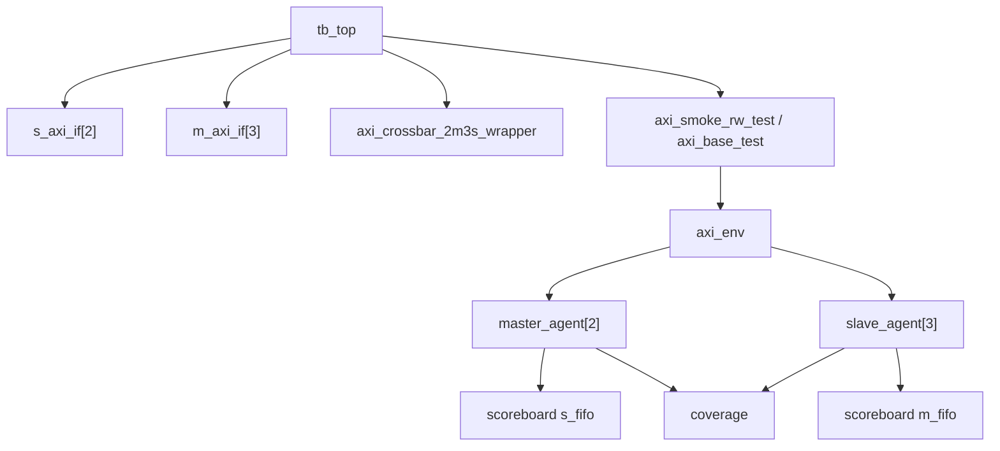

# 08 tb_top 与 axi_env 串接关系

## `tb_top.sv`

文件：

```text
10_uvm_work/tb/top/tb_top.sv
```

重点：

- 产生 `clk/rst/aresetn`
- 实例化 `s_axi_if[AXI_S_COUNT]`
- 实例化 `m_axi_if[AXI_M_COUNT]`
- 实例化 `axi_crossbar_2m3s_wrapper`
- 给每个 agent 设置 virtual interface
- 启动测试

## `axi_env.svh`

文件：

```text
10_uvm_work/tb/env/axi_env.svh
```

重点：

- 创建 `master_agent[AXI_S_COUNT]`
- 创建 `slave_agent[AXI_M_COUNT]`
- 创建 `vseqr/scb/cov`
- 把 master/slave monitor 的 analysis port 连接到 scoreboard 和 coverage

环境连接图：


