## 1. 项目定位

这个项目验证的是一个 **AXI-Lite 到 SPI 的协议桥**。

从系统视角看：

- CPU 侧通过 AXI-Lite 总线访问 DUT 内部寄存器；
- DUT 根据寄存器配置产生 SPI 时序；
- SPI 侧连接一个 SPI 从设备 / 外设模型；
- UVM testbench 同时扮演 AXI master 和 SPI 观测者，用来检查协议桥行为是否正确。

所以 testbench 的核心任务是：

1. 通过 AXI 写寄存器配置 DUT；
2. 通过 AXI 写 `MOSI_DATA` 和 `START` 发起 SPI 传输；
3. 通过 SPI monitor 观察真实 SPI 输出；
4. 用 scoreboard 比对 AXI 侧写入数据和 SPI 侧实际输出数据。

---

## 2. UVM 静态结构

当前 UVM component 树大致如下：

```text
uvm_top
└── uvm_test_top : <当前 test>
    ├── env_cfg : environment_config
    │   ├── axi_cfg : axi_config
    │   └── spi_cfg : spi_config
    └── env : tb_environment
        ├── axi_agt : axi_agent
        │   ├── axi_sqr : axi_sequencer
        │   ├── axi_drv : axi_driver
        │   └── axi_mtr : axi_monitor
        ├── spi_mtr : spi_monitor
        ├── scb : tb_scoreboard
        │   ├── axi_export
        │   └── spi_export
        └── cov : tb_coverage
            ├── axi_export
            └── spi_export
```

注意：

- `env / agent / driver / monitor / scoreboard / coverage` 是 `uvm_component`，会出现在 component topology 里；
- `axi_seq_item`、`axi_write_seq`、`axi_spi_cfg_seq` 这类是 `uvm_object`，不是长期存在的 component，通常不会作为 component 树节点打印出来；
- `env_cfg / axi_cfg / spi_cfg` 是配置对象，本质也是 object，只是被 test 创建后挂在 test 里作为配置句柄使用。

---

## 3. 第一条线：build_phase 创建组件和分发配置

`build_phase` 的方向是 **top-down**。

它主要做两件事：

1. 用 `type_id::create()` 创建下级 component / object；
2. 用 `uvm_config_db::set()` 分发配置对象或 virtual interface；
3. 用 `uvm_config_db::get()` 取回上层分发下来的配置。

### 3.1 tb_top 层

`tb_top` 是 SystemVerilog module，不是 UVM component。

它负责：

1. 声明真实信号，例如 `ACLK`、`ARESETN`、`MOSI`、`CS`、`SCLK`；
2. 实例化 `axi_interface` 和 `spi_interface`；
3. 把 interface 信号连接到 DUT 端口；
4. 实例化 DUT；
5. 实例化 SVA checker；
6. 通过 `uvm_config_db::set(null, "uvm_test_top", "axi_vif", axi_vif)` 把 AXI virtual interface 传给 UVM 世界；
7. 通过 `uvm_config_db::set(null, "uvm_test_top", "spi_vif", spi_vif)` 把 SPI virtual interface 传给 UVM 世界；
8. 调用 `run_test()` 启动 UVM phase 机制。

### 3.2 test_base 层

`test_base` 是所有 test 的基础类。

它负责：

1. 用 `environment_config::type_id::create("env_cfg", this)` 创建 `env_cfg`；
2. 用 `axi_config::type_id::create()` 和 `spi_config::type_id::create()` 创建 `axi_cfg / spi_cfg`；
3. 用 `uvm_config_db#(virtual axi_interface)::get()` 拿到 `axi_vif`；
4. 用 `uvm_config_db#(virtual spi_interface)::get()` 拿到 `spi_vif`；
5. 把 vif 放进对应 config：
   - `env_cfg.axi_cfg.vif = axi_vif`
   - `env_cfg.spi_cfg.vif = spi_vif`
6. 用 `uvm_config_db#(environment_config)::set(this, "env", "environment_config", env_cfg)` 把 `env_cfg` 分发给 `env`；
7. 用 `tb_environment::type_id::create("env", this)` 创建 `env`；
8. 在 `end_of_elaboration_phase` 调用 `uvm_top.print_topology()` 打印 UVM topology。

### 3.3 env 层

`tb_environment` 负责搭出验证环境主体：

1. 用 `uvm_config_db#(environment_config)::get()` 获取 `environment_config`；
2. 用 `uvm_config_db#(axi_config)::set()` 把 `axi_cfg` 分发给 AXI agent；
3. 用 `axi_agent::type_id::create("axi_agt", this)` 创建 AXI agent；
4. 用 `uvm_config_db#(spi_config)::set()` 把 `spi_cfg` 分发给 SPI monitor；
5. 用 `uvm_config_db#(axi_config)::set()` 把 `axi_cfg` 也分发给 SPI monitor，用于观察 reset；
6. 用 `spi_monitor::type_id::create()`、`tb_scoreboard::type_id::create()`、`tb_coverage::type_id::create()` 创建对应组件；
7. 把必要的 config 句柄直接赋给 scoreboard，例如 `scb.axi_cfg = env_cfg.axi_cfg`。

### 3.4 agent 层

AXI agent 是 active agent，内部包含：

- `axi_sequencer`：接收 sequence 发来的 item；
- `axi_driver`：把 item 翻译成 AXI interface 上的真实信号；
- `axi_monitor`：观察 AXI interface 上的真实信号，重新打包成 transaction。

AXI agent 在 build 阶段通常会：

1. 用 `uvm_config_db#(axi_config)::get()` 获取 `axi_config`；
2. 用 `uvm_config_db#(axi_config)::set()` 把 `axi_config` 分发给 sequencer / driver / monitor；
3. 用 `axi_sequencer::type_id::create()`、`axi_driver::type_id::create()`、`axi_monitor::type_id::create()` 创建内部组件。


### 3.5 build_phase 方法调用链小结

```systemverilog
// tb_top: 把真实 interface 句柄送进 UVM 世界
uvm_config_db#(virtual axi_interface)::set(null, "uvm_test_top", "axi_vif", axi_vif);
uvm_config_db#(virtual spi_interface)::set(null, "uvm_test_top", "spi_vif", spi_vif);
run_test();

// test_base: 创建配置对象，并取回 tb_top 传入的 vif
env_cfg         = environment_config::type_id::create("env_cfg", this);
env_cfg.axi_cfg = axi_config::type_id::create("axi_cfg", this);
env_cfg.spi_cfg = spi_config::type_id::create("spi_cfg", this);

uvm_config_db#(virtual axi_interface)::get(this, "", "axi_vif", env_cfg.axi_cfg.vif);
uvm_config_db#(virtual spi_interface)::get(this, "", "spi_vif", env_cfg.spi_cfg.vif);

// test_base: 把 env_cfg 继续交给 env
uvm_config_db#(environment_config)::set(this, "env", "environment_config", env_cfg);
env = tb_environment::type_id::create("env", this);

// env / agent: 下发 config，创建下级组件
uvm_config_db#(axi_config)::set(this, "axi_agt", "axi_config", env_cfg.axi_cfg);
axi_agt = axi_agent::type_id::create("axi_agt", this);
```


- `set()`：上层把东西放进 `config_db`；
- `get()`：下层从 `config_db` 取东西；
- `type_id::create()`：通过 factory 创建 object / component；
- `run_test()`：启动 UVM test 和 phase 流程。
---

## 4. 第二条线：connect_phase 连接组件

`connect_phase` 负责把组件之间的 TLM 端口连接起来。

典型连接有两类：

### 4.1 激励执行线

```text
sequence -> sequencer -> driver -> virtual interface -> DUT
```

含义：

1. test 创建 sequence；
2. test 调用 `seq.start(env.axi_agt.axi_sqr)`，把这个 sequence 交给指定 sequencer 执行。UVM 会把 sequence 和 sequencer 建立运行时关联，然后调用 sequence 的 `body()`；
3. sequence 在 `body()` 中创建 item，并通过 `start_item/finish_item` 把 item 发送给 sequencer；
4. sequencer 接收并仲裁 item；
5. driver 调用 `seq_item_port.get_next_item(item)` 从 sequencer 拉取 item；
6. driver 根据 item 字段驱动 AXI interface；
7. driver 完成该 item 后调用 `seq_item_port.item_done()` 通知 sequencer；
8. DUT 接收真实 AXI 信号。

driver 和 sequencer 之间使用的是 UVM 专用的 sequence item pull 接口：

```systemverilog
axi_drv.seq_item_port.connect(axi_sqr.seq_item_export);
```

这里容易混淆的一点：

- driver 侧叫 `seq_item_port`；
- sequencer 侧叫 `seq_item_export`；
- 虽然名字叫 export，但它内部最终落到 sequencer 提供的实现上。

更具体的运行时调用链是：

```systemverilog
// test
seq.start(env.axi_agt.axi_sqr);

// sequence body
start_item(item);
item.write = 1'b1;
item.addr  = addr;
item.wdata = data;
finish_item(item);

// driver run_phase / get_and_drive
seq_item_port.get_next_item(item);
// drive_write(item) 或 drive_read(item)
seq_item_port.item_done();
```

这几个方法的语义：

| 方法                    | 调用位置     | 作用                                                            |
| --------------------- | -------- | ------------------------------------------------------------- |
| `seq.start(sqr)`      | test     | 让 sequence 在指定 sequencer 上执行                                  |
| `body()`              | sequence | sequence 的主体流程，由 `start()` 间接启动                               |
| `start_item(item)`    | sequence | 向 sequencer 申请发送一个 item，等待仲裁允许                                |
| `finish_item(item)`   | sequence | item 字段已经填好，正式交给 sequencer                                    |
| `get_next_item(item)` | driver   | driver 阻塞等待 sequencer 提供下一个 item，并拿到 item 句柄                  |
| `item_done()`         | driver   | driver 已经把这笔 item 翻译成总线时序并执行完成，通知 sequencer 这笔 transaction 结束 |

`get_next_item()` 和 `item_done()` 是一对。

一笔 item 在 driver 里的完整生命周期是：

1. driver 调用 `seq_item_port.get_next_item(item)`；
2. 如果 sequencer 当前没有可用 item，driver 会阻塞等待；
3. sequencer 有 item 后，把 item 句柄交给 driver；
4. driver 读取 item 字段，例如 `write / addr / wdata / wstrb / aw_delay / w_delay`；
5. driver 根据 `item.write` 选择 AXI 写流程或读流程；
6. driver 把 transaction 翻译成 interface 上的真实信号时序；
7. 写流程中，driver 等 AW/W/B 通道完成；读流程中，driver 等 AR/R 通道完成；
8. 如果是读，driver 还会把读回来的 `RDATA/RRESP` 填回 `item.rdata/item.rresp`；
9. driver 调用 `seq_item_port.item_done()`，告诉 sequencer：这笔 item 已经处理完，可以继续下一笔。

如果 driver 只调用 `get_next_item()`，但最后不调用 `item_done()`，sequencer 会认为上一笔 item 还没完成，后续 sequence/item 可能会卡住。

### 4.2 观测分析线

```text
monitor -> scoreboard / coverage
```

monitor 通过 `uvm_analysis_port` 广播观测到 transaction。

具体方法调用是：

```systemverilog
// monitor
axi_mtr_port.write(item);
spi_mtr_port.write(item);

// scoreboard / coverage
function void write_axi(axi_seq_item item);
function void write_spi(spi_seq_item item);
```

scoreboard 和 coverage 通过 analysis imp 接收这些 transaction。`analysis_port.write(item)` 被调用时，连接到这个 port 的所有 imp 端都会触发对应的 `write_*()` 方法。

例如：

```systemverilog
axi_agt.axi_mtr_port.connect(scb.axi_export);
spi_mtr.spi_mtr_port.connect(scb.spi_export);

axi_agt.axi_mtr_port.connect(cov.axi_export);
spi_mtr.spi_mtr_port.connect(cov.spi_export);
```

这条线的特点：

- monitor 不关心谁订阅它；
- analysis 是单向广播；
- 一个 analysis port 可以连接多个 subscriber；
- scoreboard 和 coverage 各自实现自己的 `write_*()` 方法。

---

## 5. TLM 端口理解

UVM 组件之间不应该直接互相调用内部方法，而是通过 TLM 端口通信。

一个 TLM 端口类可以理解成：

```text
端口类 = 角色 × 通信类型
```

### 5.1 角色

| 角色 | 位置 | 方法实现在哪里 |
|---|---|---|
| `port` | 发起调用的一端 | 不在自身，在下游 |
| `export` | 中转端 | 不在自身，在更下游 |
| `imp` | 调用落地端 | 就在当前组件 |

### 5.2 通信类型

| 通信类型 | 语义 | 阻塞性 | 常见用途 |
|---|---|---|---|
| `analysis` | 单向广播 | 非阻塞 | monitor 到 scoreboard / coverage |
| `seq_item_pull` | driver 主动拉 item | 阻塞 | sequencer 到 driver |
| `get` | 拉取数据 | 可阻塞 | 一般 TLM 建模 |
| `put` | 推送数据 | 可阻塞 | 一般 TLM 建模 |
| `peek` | 查看但不取走 | 可阻塞 | FIFO 类建模 |
| `transport` | request + response | 可阻塞 | 请求响应模型 |

### 5.3 常见端口类

| 类型 / 角色 | port | export | imp |
|---|---|---|---|
| analysis | `uvm_analysis_port` | `uvm_analysis_export` | `uvm_analysis_imp` |
| seq_item_pull | `uvm_seq_item_pull_port` | `uvm_seq_item_pull_export` | `uvm_seq_item_pull_imp` |
| get / put | `uvm_*_port` | `uvm_*_export` | `uvm_*_imp` |

---

## 6. interface、virtual interface、item、sequence

### 6.1 interface

`interface` 是 DUT 对应的真实物理接口集合。

例如 AXI interface 中会包含：

- `AWADDR / AWVALID / AWREADY`
- `WDATA / WSTRB / WVALID / WREADY`
- `BRESP / BVALID / BREADY`
- `ARADDR / ARVALID / ARREADY`
- `RDATA / RVALID / RREADY / RRESP`

它描述的是信号，不是 transaction。

### 6.2 virtual interface

UVM class 不能直接实例化硬件 interface。

所以 testbench 会在 `tb_top` 中实例化真实 interface，然后把它的句柄作为 `virtual interface` 传给 UVM class。

driver / monitor 拿到 vif 后，就能用：

```systemverilog
vif.AWVALID <= 1'b1;
if (vif.AWREADY) ...
```

去驱动或观察真实信号。

### 6.3 sequence item

`axi_seq_item` 表示一笔 AXI transaction。

它不是 AXI 信号本身，而是对一次读写操作的抽象封装。

典型字段包括：

| 字段 | 作用 |
|---|---|
| `write` | 1 表示写，0 表示读 |
| `addr` | 本次 transaction 的地址 |
| `wdata` | 写数据 |
| `wstrb` | 写字节选通 |
| `aw_delay` | AW 通道延迟，用于构造握手场景 |
| `w_delay` | W 通道延迟，用于构造握手场景 |
| `rdata` | 读回数据，由 driver / monitor 填写 |
| `bresp` | 写响应 |
| `rresp` | 读响应 |

sequence item 的意义是：

> seq 只需要描述“我要做一笔什么 transaction”，driver 再负责把它翻译成具体 AXI 时序。

### 6.4 sequence

sequence 负责创建 item，并把 item 发送给 sequencer。

例如：

- `axi_write_seq`：封装一笔 AXI 写；
- `axi_read_seq`：封装一笔 AXI 读；
- `axi_spi_cfg_seq`：封装 SPI 寄存器配置和一次可选传输。

当前项目里，`axi_spi_cfg_seq` 的设计思想是：

1. sequence 内部带默认 SPI 配置；
2. test 只覆盖自己真正关心的字段；
3. sequence body 统一写 SPI 配置寄存器；
4. 如果 `start_i == 1`，则额外写 `MOSI_DATA` 并触发 `START`。

所以 test 里应该尽量写成：

```systemverilog
axi_spi_cfg_seq seq = axi_spi_cfg_seq::type_id::create("seq");
seq.word_len_i  = 2'b01;
seq.mosi_data_i = 32'h1234;
seq.start(env.axi_agt.axi_sqr);
```

而不是每个 test 都重复写一大段默认配置。

---

## 7. 数据流动

```mermaid
%%{init: {
  "theme": "base",
  "themeVariables": {
    "background": "#1f2329",
    "mainBkg": "#262b33",
    "primaryColor": "#262b33",
    "primaryTextColor": "#d7dde8",
    "primaryBorderColor": "#6ea8fe",
    "lineColor": "#9aa4b2",
    "fontFamily": "JetBrains Mono, Microsoft YaHei UI, sans-serif",
    "edgeLabelBackground": "#1f2329"
  }
}}%%

flowchart LR
    A["test<br/>创建 seq<br/>覆盖必要参数<br/>seq.start(sqr)"]
    B["seq.body()<br/>start_item(item)<br/>设置 write / addr / wdata / wstrb<br/>finish_item(item)"]
    C["sequencer<br/>接收并仲裁 item<br/>等待 driver 拉取"]
    D{"item.write ?"}
    E["driver 写流程<br/>get_next_item(item)<br/>驱动 AW / W<br/>等待 B 响应<br/>item_done()"]
    F["driver 读流程<br/>get_next_item(item)<br/>驱动 AR<br/>等待 R 数据<br/>item_done()"]
    G["virtual interface<br/>driver 通过 vif 访问真实信号"]
    H["axi_interface<br/>真实 AXI 信号集合"]
    I["DUT<br/>AXI-Lite to SPI bridge"]
    J["monitor<br/>观察真实信号<br/>打包 item<br/>analysis_port.write(item)"]
    K["scoreboard / coverage<br/>write_axi / write_spi<br/>检查结果 / 收集覆盖率"]

    A --> B --> C --> D
    D -->|write| E --> G
    D -->|read| F --> G
    G --> H --> I
    H --> J --> K

    classDef stage fill:#262b33,stroke:#6ea8fe,color:#d7dde8,stroke-width:1.5px;
    classDef decision fill:#332f26,stroke:#e5c07b,color:#f1e2b8,stroke-width:1.5px;
    classDef iface fill:#24313a,stroke:#56b6c2,color:#d7f3f5,stroke-width:1.5px;
    classDef dut fill:#2a3328,stroke:#98c379,color:#dff3d8,stroke-width:1.5px;
    classDef check fill:#302a38,stroke:#c678dd,color:#eadcf5,stroke-width:1.5px;

    class A,B,C,E,F stage;
    class D decision;
    class G,H iface;
    class I dut;
    class J,K check;
```



```text
tb_top 创建真实硬件世界
  -> test_base 创建 UVM 环境和配置
  -> env 创建 agent / monitor / scoreboard / coverage
  -> connect_phase 连接 driver-sequencer 和 monitor-subscriber
  -> test 调用 seq.start(sqr)
  -> seq.body() 中 start_item / finish_item 发送 item
  -> driver 调用 get_next_item(item) 取得 item
  -> driver 把 item 翻译成 AXI 信号
  -> driver 调用 item_done() 结束本笔 transaction
  -> DUT 执行 AXI 到 SPI 的协议转换
  -> monitor 观察真实信号并调用 analysis_port.write(item)
  -> scoreboard / coverage 的 write_axi / write_spi 被调用
  -> scoreboard 检查结果，coverage 收集覆盖率
```
---

## 8. 核心组件职责

### 8.1 driver

`driver` 是主动组件，核心职责是：

> 从 `sequencer` 获取 `sequence item`，再按照 AXI 协议时序，把 item 里的抽象字段翻译成 interface 上的真实信号。

在这个项目里，`axi_driver` 主要做这些事：

1. 在 `build_phase` 中通过 `uvm_config_db#(axi_config)::get()` 获取 `axi_cfg`；
2. 从 `axi_cfg.vif` 拿到 `virtual axi_interface`；
3. 在 `run_phase` 中启动驱动线程和 reset 监听线程；
4. 调用 `seq_item_port.get_next_item(item)` 从 sequencer 拉取 `axi_seq_item`；
5. 根据 `item.write` 选择 `drive_write(item)` 或 `drive_read(item)`；
6. 完成 AXI transaction 后调用 `seq_item_port.item_done()` 通知 sequencer。

典型串行流程是：

```systemverilog
forever begin
    seq_item_port.get_next_item(item);

    if (item.write)
        drive_write(item);  // AW / W / B 写通道
    else
        drive_read(item);   // AR / R 读通道

    seq_item_port.item_done();
end
```

这里的分工要分清楚：

| 对象 | 责任 |
|---|---|
| `sequence` | 创建 item，设置 `write / addr / wdata / wstrb` 等字段 |
| `sequencer` | 仲裁 item，并把 item 提供给 driver |
| `driver` | 通过 `get_next_item()` 拿 item，再按协议驱动 `vif` |
| `interface` | 承载真实 AXI 信号 |
| `DUT` | 响应真实 AXI transaction |

`item_done()` 的位置很关键。它应该在该 item 对应的总线动作完成后调用。对写 transaction 来说，通常是 AW/W 握手完成并收到 B 响应之后；对读 transaction 来说，通常是 AR 握手完成并收到 R 数据之后。

如果 driver 调了 `get_next_item()`，但没有调 `item_done()`，sequencer 会认为上一笔 item 还没有结束，后面的 item 可能会卡住。

#### driver 和 reset

`axi_driver` 需要同时做两件事：

1. 持续接收 sequence item，并驱动 AXI 总线；
2. 持续监听 reset，在 reset 到来时立即清掉 master 侧输出信号。

因为一个 task 线程同一时间只能等待一个事件，所以不能只靠一个顺序流程。例如 driver 正在 `while (!vif.AWREADY)` 里等写地址握手时，它不会同时去等 `negedge vif.ARESETN`。

所以 driver 常见结构是：

```systemverilog
fork
    get_and_drive();
    reset_signals();
join_none
```

| task              | 作用                                                                          |
| ----------------- | --------------------------------------------------------------------------- |
| `get_and_drive()` | `forever` 拉取 item，并执行 AXI read/write                                        |
| `reset_signals()` | `forever` 监听 reset，reset 来时清 `AWVALID / WVALID / BREADY / ARVALID / RREADY` |

`join_none` 的意思不是等待两个 task 结束，而是启动两个后台线程后让 `run_phase` 继续往下走。因为这两个 task 内部都是 `forever`，它们会在整个仿真期间持续工作。


`get_and_drive()`

内部通过参数化delay实现aw/w、ar/r的三种时序，但在dut中，
```
if (~axi_awready && S_AXI_AWVALID && S_AXI_WVALID && aw_en)
    axi_awready <= 1'b1;
    
if (~axi_wready && S_AXI_WVALID && S_AXI_AWVALID && aw_en)
    axi_wready <= 1'b1;
```
只有地址和数据都到齐，从机/主机才会准备接收数据；


`get_and_drive()`

driver 内部通过 `aw_delay` / `w_delay` 控制 `AWVALID` 和 `WVALID` 的拉起时间，因此可以制造三种写通道时序：

- `aw_delay < w_delay`：AW 地址先到；
- `aw_delay > w_delay`：W 数据先到；
- `aw_delay == w_delay`：AW/W 同时到。

但当前 DUT 的 AXI-Lite slave 逻辑比较保守：

```verilog
if (~axi_awready && S_AXI_AWVALID && S_AXI_WVALID && aw_en)
    axi_awready <= 1'b1;

if (~axi_wready && S_AXI_WVALID && S_AXI_AWVALID && aw_en)
    axi_wready <= 1'b1;
```
也就是说，DUT 不会单独接收 AW 或单独接收 W。只有 `AWVALID` 和 `WVALID` 都有效，并且 `aw_en == 1` 时，DUT 才会同时拉起 `AWREADY` 和 `WREADY`，完成写地址和写数据的接收
#### 普通模式和并发模式

普通模式下，driver 串行处理 item：

```text
get item -> drive_write / drive_read -> item_done -> get next item
```

这种模式最清楚，适合普通寄存器读写。

项目里的 `concurrent_mode` 会把写 item 和读 item 分到不同 mailbox，由不同 worker 并行驱动。它的目的不是让普通配置更方便，而是制造 `AR` 和 `AW/W` 同时活跃的场景，用来验证 DUT 的读写通道是否互不阻塞。

mailbox：SystemVerilog 自带的线程安全 FIFO 队列（默认阻塞，会一直等）；
mailbox #(axi_seq_item) wr_mbx = new(); 意思是创建一个 mailbox，里面专门放 `axi_seq_item` 类型的句柄。
wr_mbx.put(item);  // 放到队尾
wr_mbx.get(wit);   // 从队头取出

要注意：并发模式里 dispatch 线程可能提前 `item_done()`，所以 read sequence 如果依赖 `item.rdata` 回传，可能不如串行模式直观。普通读寄存器建议优先用串行模式。

### 8.2 monitor

`monitor` 是被动组件，核心职责是：

> 从 interface 上观察真实 pin-level 时序，再重新打包成 transaction，通过 analysis port 广播出去。

monitor 和 driver 都会接触 `vif`，但方向相反：

| 组件 | 行为 |
|---|---|
| `driver` | 主动驱动 interface 信号 |
| `monitor` | 被动观察 interface 信号 |

在这个项目里：

| monitor | 观察内容 | 输出 item |
|---|---|---|
| `axi_monitor` | AXI `AW/W/B` 和 `AR/R` 握手 | `axi_seq_item` |
| `spi_monitor` | SPI `CS/SCLK/MOSI` 数据帧 | `spi_seq_item` |

monitor 不从 sequencer 拿 item。它看到真实信号发生后，自己创建 item：

```systemverilog
axi_seq_item item = axi_seq_item::type_id::create("item");
item.addr  = vif.AWADDR;
item.write = 1'b1;
item.wdata = vif.WDATA;
item.wstrb = vif.WSTRB;

axi_mtr_port.write(item);
```

这里的 `write(item)` 是 `uvm_analysis_port` 的广播方法，不是 AXI write transaction。

`axi_monitor` 通常会有两个常驻线程：

```systemverilog
fork
    write_monitor();
    read_monitor();
join_none
```

原因是 AXI 写通道和读通道相对独立，monitor 需要同时观察写事务和读事务。

`spi_monitor` 的重点是观察 `CS/SCLK/MOSI`。当前项目里，它在一帧 SPI 开始时通过 `uvm_hdl_read()` 后门读取 DUT 当前配置，例如 `spi_mode` 和 `word_len`，然后用这些配置解释 MOSI 数据帧。这样 scoreboard 不需要靠 AXI 配置写来同步 SPI 配置状态。

### 8.3 scoreboard

`scoreboard` 是检查组件，核心职责是：

> 接收 monitor 已经打包好的 transaction，建立 expected model，并把 DUT 实际行为和 expected 比较。

它不负责驱动 DUT，也不应该自己抓 pin-level 时序。pin-level 时序由 monitor 观察，scoreboard 只处理 transaction 级数据。

当前项目的 scoreboard 同时接两路 transaction：

| 来源 | 端口 | 数据 |
|---|---|---|
| `axi_monitor` | `axi_export` | AXI 侧寄存器访问 item |
| `spi_monitor` | `spi_export` | SPI 侧实际输出 item |

核心逻辑是：

```text
AXI monitor 观察到写 MOSI_DATA
        ↓
scoreboard 根据当前 word_len 生成 expected_data
        ↓
expected_data_q.push_back(expected_data)
        ↓
SPI monitor 捕获一帧真实 MOSI 数据
        ↓
scoreboard expected_data_q.pop_front()
        ↓
expected 和 actual 比较
```

也就是：

```text
AXI transaction 提供期望值来源
SPI transaction 提供实际输出结果
scoreboard 负责 FIFO 顺序比对
```

需要字长时，scoreboard 通过后门读取 DUT 寄存器，例如：

```systemverilog
uvm_hdl_data_t val;
uvm_hdl_read("tb_top.DUT.AXI_SPI_n_regs0.slv_reg4", val);
```

然后根据 `word_len` 截断 expected：

```text
word_len = 32-bit -> 比较 32 bit
word_len = 16-bit -> 只比较低 16 bit
word_len = 8-bit  -> 只比较低 8 bit
word_len = 4-bit  -> 只比较低 4 bit
```

scoreboard 接收 analysis transaction 的接口一般是：

```systemverilog
`uvm_analysis_imp_decl(_axi)
`uvm_analysis_imp_decl(_spi)

uvm_analysis_imp_axi #(axi_seq_item, tb_scoreboard) axi_export;
uvm_analysis_imp_spi #(spi_seq_item, tb_scoreboard) spi_export;
```

对应两个回调函数：

```systemverilog
function void write_axi(axi_seq_item item);
function void write_spi(spi_seq_item item);
```

调用关系是：

```text
axi_monitor.axi_mtr_port.write(item) -> scb.write_axi(item)
spi_monitor.spi_mtr_port.write(item) -> scb.write_spi(item)
```

#### scoreboard 和 reset

reset 发生时要清空 `expected_data_q`：

```systemverilog
@(negedge axi_cfg.vif.ARESETN);
expected_data_q.delete();
```

原因是 reset 可能打断一帧 SPI 传输。reset 前已经入队但还没完成比较的 expected，不能再拿去和 reset 后的新 SPI actual 比，否则容易产生假 fail。

这里判断队列是否为空只是为了少打一条没意义的 log，不影响功能。直接 `expected_data_q.delete()` 也可以。

### 8.4 coverage

`coverage` 也是接收 monitor transaction 的组件，但它的目的和 scoreboard 不一样：

| 组件 | 目的 |
|---|---|
| `scoreboard` | 判断 DUT 行为对不对 |
| `coverage` | 统计测试空间有没有测到 |

coverage 不驱动 DUT，不创建激励 item，也不决定 pass/fail。

在这个项目里，coverage 可以关注：

- `word_len` 是否覆盖 4 / 8 / 16 / 32 bit；
- `spi_mode` 是否覆盖 mode0 / mode1 / mode2 / mode3；
- `sck_speed` 是否覆盖不同分频；
- `cs_sck / sck_cs / ifg` 是否覆盖边界值；
- `spi_mode x word_len` 组合是否覆盖；
- `spi_mode x sck_speed` 组合是否覆盖；
- AXI 握手是否覆盖 AW/W 同时、AW 先到、W 先到等场景。

coverage 的结论是“测没测到”，不是“对不对”。如果某个 coverpoint 没覆盖，说明 test suite 还缺场景；如果 scoreboard 报错，说明 DUT 行为或参考模型有不一致。

### 8.5 小结表

| 组件 | 是否接触 vif | 是否创建 item | 是否驱动信号 | 主要方法 / 端口 |
|---|---|---|---|---|
| `sequence` | 否 | 是，创建激励 item | 否 | `start_item()` / `finish_item()` |
| `sequencer` | 否 | 否 | 否 | `seq_item_export`，仲裁 item |
| `driver` | 是 | 否，接收 sequence 的 item | 是 | `get_next_item()` / `item_done()` / `drive_write()` / `drive_read()` |
| `monitor` | 是 | 是，把采样结果打包成 item | 否 | `analysis_port.write(item)` |
| `scoreboard` | 通常不直接碰 pin，本项目用 `axi_cfg.vif` 监听 reset，并用 `uvm_hdl_read()` 后门读寄存器 | 否 | 否 | `write_axi()` / `write_spi()` |
| `coverage` | 否 | 否 | 否 | `write_axi()` / `write_spi()` / `covergroup.sample()` |

整体数据流可以记成：

```text
sequence 产生意图
sequencer 仲裁意图
driver 执行意图
interface 承载真实信号
DUT 做协议转换
monitor 观察结果
scoreboard 检查结果
coverage 统计覆盖
```

---

## 9. 方法级调用速查

这一节专门把笔记里所有“抽象动作”落到具体 UVM / SystemVerilog 方法上。

### 9.1 创建对象 / 组件

常用方法是：

```systemverilog
obj = some_type::type_id::create("obj_name", parent);
```

例子：

```systemverilog
env = tb_environment::type_id::create("env", this);
axi_agt = axi_agent::type_id::create("axi_agt", this);
seq = axi_spi_cfg_seq::type_id::create("seq");
item = axi_seq_item::type_id::create("item");
```

含义：

- component 创建时通常带 parent：`create("env", this)`；
- sequence / item 是 object，很多时候只写名字：`create("seq")`；
- 使用 `type_id::create()` 的前提是类里做了 factory 注册，例如 `` `uvm_component_utils`` 或 `` `uvm_object_utils``。

### 9.2 配置传递

配置传递主要靠 `uvm_config_db::set()` 和 `uvm_config_db::get()`。

```systemverilog
// 上层 set
uvm_config_db#(virtual axi_interface)::set(null, "uvm_test_top", "axi_vif", axi_vif);

// 下层 get
uvm_config_db#(virtual axi_interface)::get(this, "", "axi_vif", env_cfg.axi_cfg.vif);
```

语义：

- `set()` 是把对象放进配置数据库；
- `get()` 是从配置数据库取对象；
- 第三个参数是 key，例如 `"axi_vif"`、`"axi_config"`、`"environment_config"`；
- get 失败通常要 `uvm_fatal()`，因为没有 vif / cfg，driver 和 monitor 无法工作。

### 9.3 phase 控制

test 的 `run_phase` 通常要控制 objection：

```systemverilog
task run_phase(uvm_phase phase);
    phase.raise_objection(this);

    // 测试主体

    phase.drop_objection(this);
endtask
```

含义：

- `raise_objection()`：告诉 UVM 当前 test 还没结束；
- `drop_objection()`：告诉 UVM 当前 test 已经完成；
- 如果没有 objection，仿真可能在 sequence 还没跑完时提前结束。

### 9.4 sequence 启动和 item 发送

```systemverilog
// test
seq = axi_spi_cfg_seq::type_id::create("seq");
seq.word_len_i  = 2'b01;
seq.mosi_data_i = 32'h1234;
seq.start(env.axi_agt.axi_sqr);
```

`seq.start(sqr)` 做的事：

1. 把 sequence 交给指定 sequencer；
2. 建立 sequence 和 sequencer 的运行时关联；
3. 间接启动 sequence 的 `body()`；
4. `body()` 里通过 `start_item()` / `finish_item()` 发送 item。

sequence 内部典型写法：

```systemverilog
item = axi_seq_item::type_id::create("item");

start_item(item);
item.write = 1'b1;
item.addr  = addr;
item.wdata = data;
item.wstrb = 4'hF;
finish_item(item);
```

含义：

- `start_item(item)`：向 sequencer 申请发送 item，可能等待仲裁；
- 给 item 字段赋值：描述这笔 transaction；
- `finish_item(item)`：告诉 sequencer，这个 item 已经准备好，可以交给 driver。

### 9.5 driver 拉取和完成 item

```systemverilog
forever begin
    seq_item_port.get_next_item(item);

    if (item.write)
        drive_write(item);
    else
        drive_read(item);

    seq_item_port.item_done();
end
```

方法含义：

- `get_next_item(item)`：driver 从 sequencer 拉取下一笔 item；没有 item 时会阻塞；
- `drive_write(item)`：把写 transaction 翻译成 AW/W/B 通道时序；
- `drive_read(item)`：把读 transaction 翻译成 AR/R 通道时序，并填回 `item.rdata/item.rresp`；
- `item_done()`：通知 sequencer，本笔 item 已经处理完成。

`item_done()` 必须在总线传输完成后调用。否则 sequencer 会认为上一笔 item 还没有结束，后面的 item 可能无法继续。

### 9.6 TLM 端口连接

connect_phase 中主要用 `.connect()`。

```systemverilog
// driver 和 sequencer
axi_drv.seq_item_port.connect(axi_sqr.seq_item_export);

// monitor 广播到 scoreboard / coverage
axi_agt.axi_mtr_port.connect(scb.axi_export);
spi_mtr.spi_mtr_port.connect(scb.spi_export);
axi_agt.axi_mtr_port.connect(cov.axi_export);
spi_mtr.spi_mtr_port.connect(cov.spi_export);
```

含义：

- `connect()` 只建立 TLM 通信路径；
- 真正的数据传输发生在 run_phase 中；
- driver/sequencer 是 pull 模式；
- monitor/scoreboard/coverage 是 analysis 广播模式。

### 9.7 monitor 广播 transaction

monitor 观察 interface 后，会重新创建 item 并广播出去。

```systemverilog
item = axi_seq_item::type_id::create("item");
item.write = 1'b1;
item.addr  = observed_addr;
item.wdata = observed_data;

axi_mtr_port.write(item);
```

SPI monitor 也是类似：

```systemverilog
item = spi_seq_item::type_id::create("item");
item.spi_data = shift_reg;

spi_mtr_port.write(item);
```

含义：

- `write(item)` 是 analysis port 的广播方法；
- monitor 调用一次 `write(item)`；
- 所有连接到这个 port 的 subscriber 都会收到这笔 transaction。

### 9.8 scoreboard / coverage 接收 transaction

scoreboard / coverage 通过 analysis imp 接收 transaction。

如果一个组件要同时接收 AXI 和 SPI 两类 transaction，需要先声明不同后缀：

```systemverilog
`uvm_analysis_imp_decl(_axi)
`uvm_analysis_imp_decl(_spi)

uvm_analysis_imp_axi #(axi_seq_item, tb_scoreboard) axi_export;
uvm_analysis_imp_spi #(spi_seq_item, tb_scoreboard) spi_export;
```

然后实现对应方法：

```systemverilog
function void write_axi(axi_seq_item item);
    // AXI transaction 到达时被调用
endfunction

function void write_spi(spi_seq_item item);
    // SPI transaction 到达时被调用
endfunction
```

调用关系是：

```text
axi_monitor.axi_mtr_port.write(item)
  -> scb.write_axi(item)
  -> cov.write_axi(item)

spi_monitor.spi_mtr_port.write(item)
  -> scb.write_spi(item)
  -> cov.write_spi(item)
```

### 9.9 scoreboard 队列比较

当前 scoreboard 的核心动作是 expected queue：

```systemverilog
// AXI 侧写 MOSI_DATA 时，生成 expected
expected_data_q.push_back(exp_data);

// SPI 侧抓到一帧时，取出最早的 expected 比对
exp_data = expected_data_q.pop_front();

if (exp_data == item.spi_data)
    match_count++;
else
    mismatch_count++;
```

含义：

- `push_back()`：AXI 侧产生一个期待值；
- `pop_front()`：SPI 侧消费最早的期待值；
- 这是 FIFO 顺序，比对“第 N 次 AXI 写入”和“第 N 帧 SPI 输出”。

reset 时要清空队列：

```systemverilog
@(negedge axi_cfg.vif.ARESETN);
expected_data_q.delete();
```

因为 reset 可能打断一帧 SPI 传输，之前入队但没完成的 expected 已经不能再拿来比较。

### 9.10 后门读 DUT 寄存器

scoreboard / monitor 如果需要直接看 DUT 内部寄存器，可以用后门读：

```systemverilog
uvm_hdl_data_t val;
uvm_hdl_read("tb_top.DUT.AXI_SPI_n_regs0.slv_reg4", val);
```

当前项目里用它读取 DUT 当前配置，例如：

- `slv_reg2[1:0]`：`spi_mode`；
- `slv_reg4[1:0]`：`word_len`。

注意：

- `uvm_hdl_read()` 是后门访问，不经过 AXI 总线；
- 它适合 checker / monitor 建参考模型；
- 不适合代替真正的 frontdoor AXI 测试。

---


