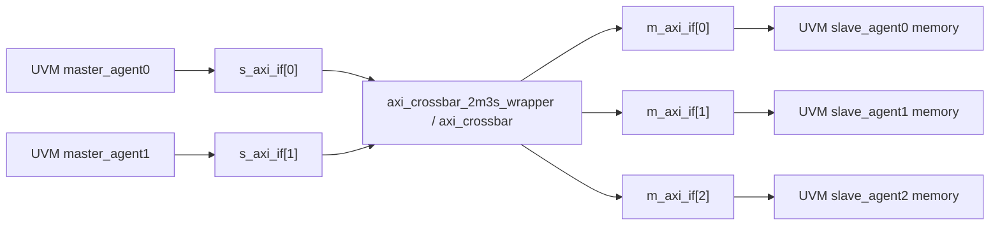

# 00 总览与数据流

注意名字：

| 名字 | 从 crossbar 角度 | 外部连接对象 | UVM 里由谁驱动 |
| --- | --- | --- | --- |
| `s_axi_*` | crossbar 的 slave interface | 外部 master | UVM master agent |
| `m_axi_*` | crossbar 的 master interface | 外部 slave | UVM slave agent 响应 |

这里最容易反直觉：`s_axi_*` 不是 slave agent，而是 DUT 被 master 访问的一侧。

当前阅读主线：

1. DUT 本体：`axi_crossbar.v`
2. wrapper：把大向量和 `axi_if[]` 接起来
3. interface：定义五通道信号和主从初始化
4. master/slave driver：请求和响应怎么流动
5. monitor/scb：如何观察和检查
